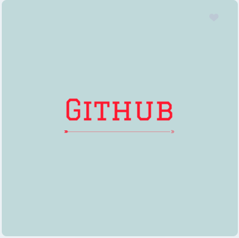

# Markdown and Git Homework
Aquest es el meu projecte de github, ja he fet el primer commit i ara vaig a seguir [Git Documentation](https://git-scm.com/docs)

## Table of Contents

- [Introduction](#introduction)
- [Features](#features)
- [Installation](#installation)
- [usage](#usage)
- [license](#license)

### Introduction 



### Features

| Feature             | Description                                   | Status             |
| ------------------  | --------------------------------------------  | ------------------ |
| Registre d'usuaris  | Permet crear i gestionar usuaris              | "Completed"        |
| Gestió de fitxers   | Exemple de seguiment i modificació de fitxers | "In Progress"      |
| Sistema de versions | Exemple pràctic de branch i commits           | "In Progress"      |

Estic procesant l'informació pel **gestió de fitxers** i **el sistema de versions**
 encara no esta acabat, pero *estic progresant* i ``utilizant algunes comandes molt utils com:``
**git branch Branca** i despres **git switch Branca** pel *sistema de versions*.

>""Programs must be written for people to read, and only incidentally for machines to execute." - Harold Abelson

### Installation

### Usage 

```python
# This is a simple Python function to add two numbers
def add_numbers(a, b):
 """Return the sum of a and b."""
 return a + b
# Example usage
result = add_numbers(5, 7)
print("The sum is:", result)
```

### License